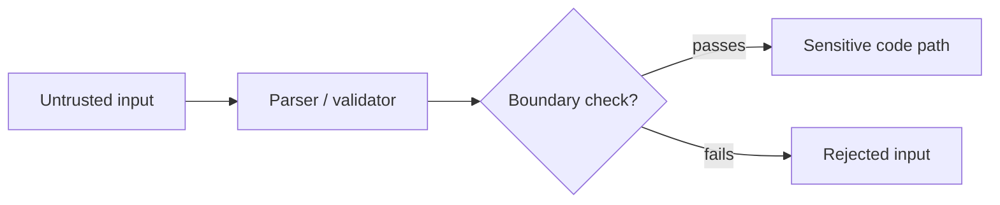
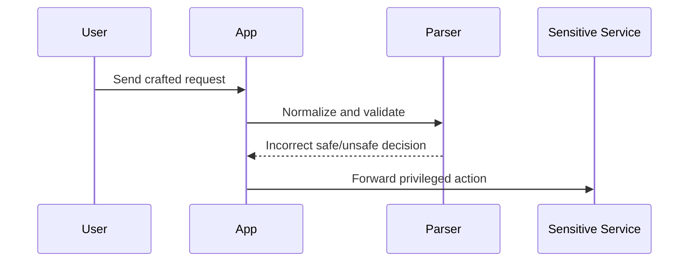

# Visualization Patterns

Use visuals to clarify mechanics, not to decorate the answer.

## Flowchart



Use this for parser flaws, auth bypass, request routing, and trust-boundary explanations.

## Sequence Diagram



Use this when interaction order matters more than memory layout.

## ASCII Memory or Packet Layout

```text
0x00  [ len_lo ][ len_hi ]
0x02  [ flags  ][ type   ]
0x04  [ user-controlled data............. ]
```

Use this for serialized objects, binary protocols, heap chunks, and frame layouts.

## Labeling rules

- Mark sourced visuals as `Observed` when tied to a public artifact or specification.
- Mark unsourced teaching visuals as `Illustrative`.
- Never present an illustrative byte sketch as if it were a captured exploit sample.

